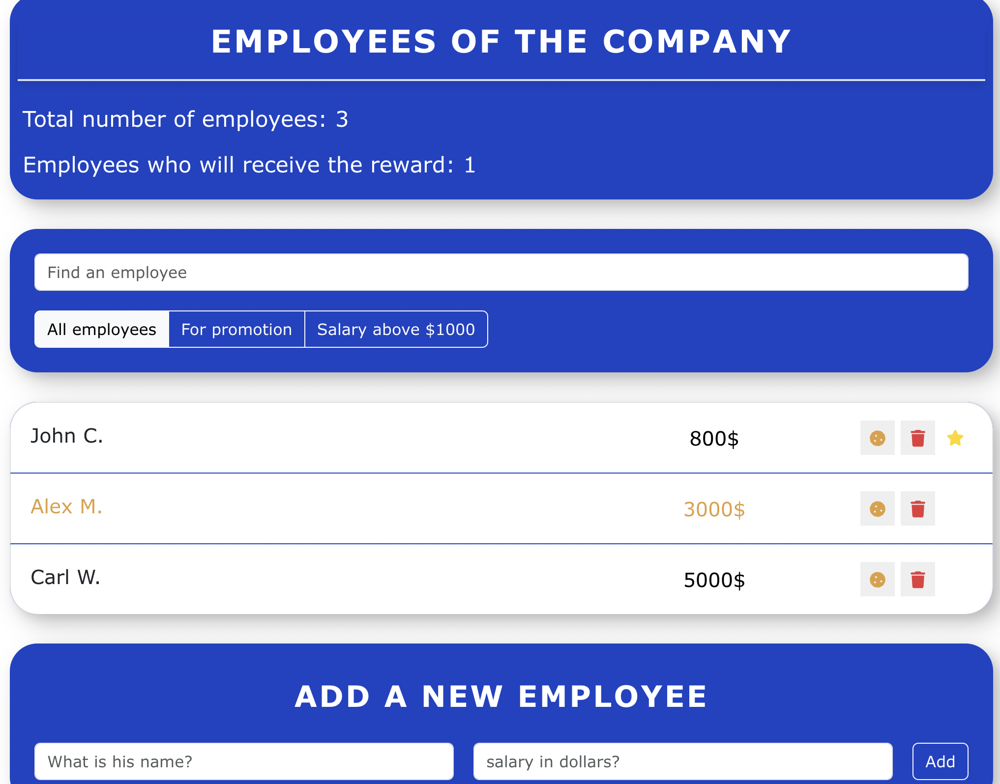

# An application for entering an employee diary.

The app allows you to track the number of employees, filter by criteria and by name. You can also add new employees and delete existing ones.

### Stack: HTML/CSS, React

### In the project directory, you can run:

**cd my-add**

**npm start**
Runs the app in the development mode.
Open http://localhost:3000 to view it in your browser.

The page will reload when you make changes.
You may also see any lint errors in the console.

### Project

